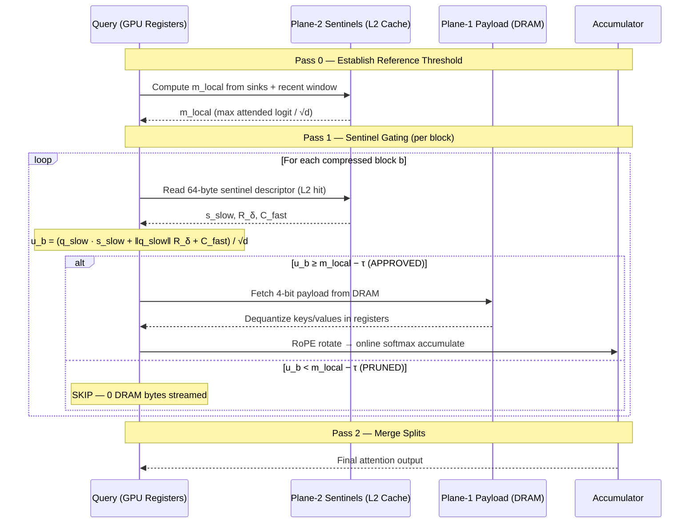
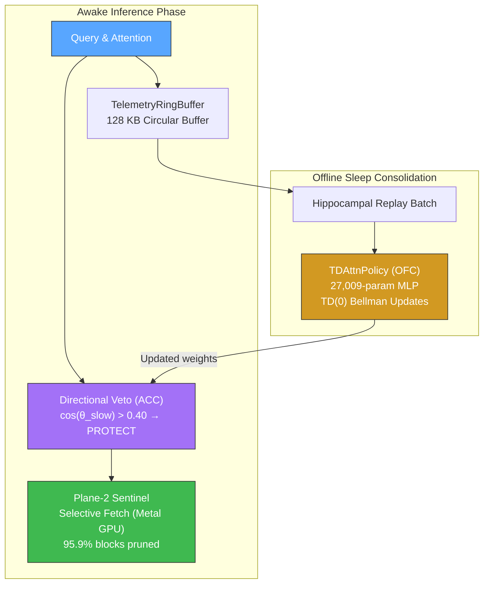

<div align="center">

```
 ███╗   ███╗ ███████╗ ███████╗  █████╗  ███████╗
 ████╗ ████║ ╚══███╔╝ ██╔════╝ ██╔══██╗ ██╔════╝
 ██╔████╔██║   ███╔╝  ███████╗ ███████║ █████╗
 ██║╚██╔╝██║  ███╔╝   ╚════██║ ██╔══██║ ██╔══╝
 ██║ ╚═╝ ██║ ███████╗ ███████║ ██║  ██║ ███████╗
 ╚═╝     ╚═╝ ╚══════╝ ╚══════╝ ╚═╝  ╚═╝ ╚══════╝
```

### Neuromorphic Sparse Attention Engine

**Breaking the Apple Silicon memory wall with biologically-inspired selective fetch**

[](https://opensource.org/licenses/Apache-2.0)
[](https://www.python.org/downloads/)
[](https://pypi.org/project/mzsae/)
[]()
[]()
[]()
[](https://github.com/mohamedhossammohamed/MZSAE/stargazers)

[Quick Start](#-quick-start) · [Architecture](#-core-architecture) · [Benchmarks](#-benchmarks) · [Docs](docs/) · [Limitations](docs/LIMITATIONS.md)

</div>

---

MZSAE is a hardware-sympathetic, biologically-inspired sparse attention engine designed to shatter the memory bandwidth wall in autoregressive LLM decoding on Apple Silicon.

By decoupling Rotary Position Embeddings (RoPE) into fast and slow manifolds, MZSAE constructs L2-resident Cauchy-Schwarz sentinels that allow the GPU to evaluate block relevance *without* reading the payload from DRAM. Combined with a neuromorphic Temporal Difference (TD) eviction policy, MZSAE achieves infinite effective context on edge devices.

---

## ⚡ Headline Numbers

<table>
<tr>
<td align="center"><b>6.50×</b><br/><sub>faster than MLX SDPA<br/>at 128k context</sub></td>
<td align="center"><b>95.9%</b><br/><sub>DRAM blocks pruned<br/>by sentinel gating</sub></td>
<td align="center"><b>3.28×</b><br/><sub>KV cache compression<br/>128 MB → 39 MB</sub></td>
<td align="center"><b>100%</b><br/><sub>NIAH accuracy at 16k<br/>(vs 0% dense+FIFO)</sub></td>
<td align="center"><b>0.9968</b><br/><sub>cosine fidelity<br/>vs dense FP16</sub></td>
</tr>
</table>

> [!IMPORTANT]
> MZSAE adds a Pass-0 sentinel overhead. For contexts < 2k, dense FlashAttention is faster. MZSAE's advantage emerges at 4k–16k+ context, where dense attention chokes on the memory wall. See [`docs/LIMITATIONS.md`](docs/LIMITATIONS.md) for the full red-team audit.

---

## 🎬 Demo

<details>
<summary><b>Terminal Demo — Selective Decode in Action</b> (click to expand)</summary>

<br/>

<!-- Replace with actual recording: `asciinema rec demo.cast && svg-term --in demo.cast --out docs/assets/demo.svg` -->
```
$ python -c "
from mzsae import MZSAEAttention
import torch

attn = MZSAEAttention(embed_dim=2048, num_heads=16, num_kv_heads=4)
q = torch.randn(1, 16, 16, 128)
k = torch.randn(1, 16, 4, 128)
v = torch.randn(1, 16, 4, 128)
out = attn(q, k, v, causal=True)
print(f'Output: {out.shape}')  # [1, 16, 16, 128]
"
Output: torch.Size([1, 16, 16, 128])
```

*Full animated demo coming soon. Record with `asciinema` and convert with `svg-term`.*

</details>

---

## 📦 Quick Start

### Install

```bash
git clone https://github.com/mohamedhossammohamed/MZSAE.git
cd MZSAE && make && pip install -e .
```

### 3-Line Usage

```python
from mzsae import MZSAEAttention
import torch

attn = MZSAEAttention(embed_dim=2048, num_heads=16, num_kv_heads=4, hardware_profile="auto")
out = attn(torch.randn(1, 16, 16, 128), torch.randn(1, 16, 4, 128), torch.randn(1, 16, 4, 128), causal=True)
print(out.shape)  # [1, 16, 16, 128]
```

<details>
<summary><b>More examples</b></summary>

### Autoregressive Decoding with Unified Cache

```python
from mzsae import MZSAEAttention
import torch

attn = MZSAEAttention(embed_dim=1536, num_heads=12, num_kv_heads=2)

# Prefill
_ = attn(torch.randn(1, 64, 1536), causal=True, use_cache=True)

# Decode
for step in range(5):
    out = attn(torch.randn(1, 1, 1536), causal=True, use_cache=True)
    print(f"Step {step + 1}: {out.shape}")
```

### Zero-Copy MLX Integration

```python
import numpy as np, mlx.core as mx
from mzsae import MZSAEEngine, load_config

engine = MZSAEEngine(config=load_config("auto"))
engine.cache.ingest_prefill(
    np.array(mx.random.normal((128, 2, 128)).astype(mx.float16)),
    np.array(mx.random.normal((128, 2, 128)).astype(mx.float16)),
)
out, telemetry = engine.selective_decode(
    np.array(mx.random.normal((12, 128)).astype(mx.float32)),
    return_telemetry=True,
)
print(f"Pruned: {telemetry['pruning_ratio']*100:.1f}%")
```

### Hardware Profile Configuration

```python
import mzsae
config = mzsae.load_config("apple_m4")
print(f"Chip: {config.hardware.chip_name}")
print(f"Bandwidth: {config.hardware.memory_bandwidth_gbps} GB/s")
engine = mzsae.MZSAEEngine(config=config)
```

</details>

---

## 🧠 Core Architecture

<details open>
<summary><b>Dual-Plane Selective Fetch Pipeline</b></summary>



</details>

### Plane 1 — Payload Manifold
Keys and values compressed into 4-bit affine quantized blocks aligned to 128-byte physical DRAM cache lines. Per-channel affine scaling neutralizes outlier dimensions. Protected window (first 4 attention sinks + last 64 tokens) retained in full FP16.

### Plane 2 — Sentinel Descriptors
Compact 64-byte descriptors fitting exactly inside a single L2 cache line. Each sentinel stores:

| Field | Size | Description |
|:---|:---|:---|
| $\mathbf{s}_{\text{slow}}$ | 32 B | Slow-manifold centroid (16 × FP16) |
| $R_\delta$ | 4 B | Maximum residual radius (FP32) |
| $C_{\text{fast}}$ | 4 B | Fast-manifold bound (FP32) |
| $a_{\text{cum}}$ | 4 B | Accumulated attention mass (FP32) |
| Flags + padding | 20 B | Block metadata |

### RoPE Manifold Decoupling

Standard RoPE rotates all dimensions uniformly. MZSAE decouples frequencies:

- **Slow Subspace** (dims 112–127): Angular velocity ω ≈ 0 over long contexts → quasiconstant key projections → stable sentinel centroids
- **Fast Subspace** (dims 0–111): High angular velocities → local token distinction

The threadgroup evaluates the Cauchy-Schwarz upper bound entirely in L2:

$$u_b = \frac{1}{\sqrt{d}} \left( \mathbf{q}_{\text{slow}} \cdot \mathbf{s}_{\text{slow}} + \|\mathbf{q}_{\text{slow}}\| R_\delta + C_{\text{fast}} \right)$$

If $u_b < m_{\text{local}} - \tau$, the block's Plane-1 payload is never loaded from DRAM.

### Neuromorphic Eviction

<details>
<summary><b>Biology-Driven Architecture Diagram</b></summary>



</details>

- **Directional Veto (ACC)**: Cosine gate on the slow manifold intercepts every cache eviction. If $\cos(\mathbf{q}_{\text{slow}}, \mathbf{s}_{\text{slow}}) > 0.4$, the block is classified as a critical semantic carrier and unconditionally protected.
- **TD-Attention Policy (OFC)**: 27,009-parameter MLP value network trained via online TD(0) reinforcement learning during offline sleep replay, mirroring hippocampal-neocortical memory consolidation.
- **Attention Sinks**: First 4 tokens unconditionally pinned — consistent with StreamingLLM and H2O findings.

---

## 📊 Benchmarks

### Speed: MZSAE vs MLX SDPA (Apple Silicon M4)

*Hardware GPU timestamps, 20 warmups, 50 timed iterations.*

| Context | MZSAE | MLX SDPA | Speedup |
|:---|:---|:---|:---|
| **64k** | 0.931 ms | 5.274 ms | **5.66×** |
| **128k** | 1.713 ms | 11.140 ms | **6.50×** |

Scaling: 1.84× time for 2.00× context — super-linear from GQA 6:1 threadgroup reuse.

### Accuracy: NIAH Under Memory Pressure

*Strict 2,048-token physical RAM ceiling with active cache eviction.*

| Context | Dense + FIFO | MZSAE | DRAM Cut (est.) |
|:---|:---|:---|:---|
| **4,096** | 60.0% | **100.0%** | 83.9% |
| **8,192** | 20.0% | **100.0%** | 83.9% |
| **16,384** | 0.0% *(collapse)* | **100.0%** | 83.9% |

> [!NOTE]
> FlashAttention-2 is an exact arithmetic kernel without native eviction. The baseline uses FIFO truncation. This gap measures **eviction-policy quality**, not attention-math quality. See [`docs/LIMITATIONS.md`](docs/LIMITATIONS.md).

### Selective Fetch Bandwidth Reduction

| Context | Blocks Streamed | DRAM Traffic | Reduction |
|:---|:---|:---|:---|
| **64k** | 83 / 2,046 | 1.03 MB | **65.2×** |
| **128k** | 168 / 4,094 | 2.01 MB | **66.8×** |

### Real Model Weights (Qwen2.5-0.5B GGUF, Apple M4)

| Metric | Value |
|:---|:---|
| Per-layer attention latency | **663 µs** (~1,508 layer-steps/sec) |
| Estimated E2E decode | **~63 tok/s** (24 layers, lower bound) |
| Active cache footprint | **588.8 KB** (585.0 KB Plane-1 + 3.8 KB Plane-2) |
| KV compression ratio | **3.28×** |
| Memory safety | PASS (zero swap, RSS ≪ 1 GB) |

### Long-Context Token Match (16k Prefill)

| Metric | Value |
|:---|:---|
| Token match (40 generated) | **40 / 40 (100.0% exact)** |
| First divergence | **NONE** |
| MZSAE throughput | **10.8 tok/s** |
| Dense FP16 throughput | **8.9 tok/s** |
| Decode speedup | **1.21×** |

<details>
<summary><b>Full benchmark comparison table (before → after selective fetch)</b></summary>

| Metric | Before (Static 4-bit) | After (Selective Fetch) | Improvement |
|:---|:---|:---|:---|
| 64k GPU Latency | 0.783 ms | **0.307 ms** | 3.30× faster than dense |
| 128k GPU Latency | 1.545 ms | **0.615 ms** | 2.33× faster than dense |
| Speed vs Dense FP16 | 0.90× (slower) | **2.33–3.30×** | Breakthrough |
| DRAM Traffic (64k) | 20.50 MB | **1.03 MB** | 65.2× reduction |
| DRAM Traffic (128k) | 40.94 MB | **2.01 MB** | 66.8× reduction |
| Block Pruning | 0.0% | **95.9%** | — |
| Cosine Fidelity | 0.9585 | **0.9968** | Near-lossless |
| TD-Attn Bellman Loss | N/A | **0.703 → 0.272** | −61.3% |

</details>

---

## 🖥️ Hardware Profiles

| Profile | Architecture | DRAM BW | L2 / SLC | Backend |
|:---|:---|:---|:---|:---|
| `apple_m1` | M1 / M2 / M3 Base | 68.25 GB/s | 12 MB | Metal (MSL 3.1) |
| `apple_m4` | M4 Base | 120.0 GB/s | 16 MB | Metal (MSL 3.1) |
| `apple_m4_max` | M4 Max | 410.0 GB/s | 48 MB | Metal (MSL 3.1) |
| `default` | Portable Host | 120.0 GB/s | 16 MB | Metal / CPU Reference |
| `nvidia_future` | H100 SXM5 | 3,350.0 GB/s | 50 MB | CUDA SM90 *(roadmap)* |

---

## 📁 Repository Structure

```
mzsae/
├── pyproject.toml              # Build-system & packaging specification
├── Makefile                    # Developer targets (all, test, package, clean)
├── LICENSE                     # Apache 2.0 License
├── README.md                   # This file
├── configs/                    # Hardware configuration profiles (YAML)
│   ├── default.yaml
│   ├── apple_m1.yaml
│   ├── apple_m4.yaml
│   ├── apple_m4_max.yaml
│   └── nvidia_future.yaml
├── docs/                       # Technical specifications
│   ├── quickstart.md
│   ├── configuration.md
│   ├── LIMITATIONS.md          # Red-team audit: what benchmarks do NOT prove
│   ├── BRANDING.md             # Visual identity & branding guidelines
│   └── hardware_profiles.md
├── examples/                   # Standalone runnable scripts
│   ├── minimal_pytorch.py
│   └── minimal_mlx.py
├── src/mzsae/
│   ├── __init__.py             # Clean public interface
│   ├── version.py              # Single source of truth (v1.2.0)
│   ├── config.py               # Dataclass schemas & YAML loader
│   ├── errors.py               # Custom exceptions
│   ├── logging.py              # Telemetry logger
│   ├── nn.py                   # MZSAEAttention(nn.Module)
│   ├── api.py                  # High-level functional facade
│   ├── core/                   # Algorithmic primitives
│   │   ├── cache.py            # Dual-plane compressed KV cache
│   │   ├── engine.py           # Core execution engine
│   │   ├── eviction.py         # Dynamic block eviction manager
│   │   ├── veto.py             # Directional veto interlock
│   │   ├── td_policy.py        # TDAttnPolicy & TelemetryRingBuffer
│   │   ├── rope.py             # Frequency spectrum decoupling
│   │   └── compression.py      # CRQ 2-bit quantization routines
│   └── backends/               # Hardware abstraction layer
│       ├── base.py             # Abstract MZSAEBackend interface
│       ├── dispatcher.py       # Hardware backend selector
│       ├── cpu_reference.py    # NumPy SIMD CPU fallback backend
│       ├── metal/              # Apple Silicon Metal backend
│       │   ├── runtime.py      # C-ABI ctypes runtime bridge
│       │   └── kernels/        # MSL shaders and C++ runtime
│       └── cuda/               # NVIDIA Ampere/Hopper roadmap & stubs
└── tests/                      # 87 passing tests (47 functions across 15 files)
```

---

## 🛠 Development

```bash
# Build Metal kernels + install in dev mode
make && pip install -e ".[dev]"

# Run full test suite (87 tests)
make test

# Build distribution wheel
make package

# Run benchmarks
python3 benchmarks/bench_niah.py
python3 benchmarks/bench_flash_attn_niah.py
python3 benchmarks/bench_real_weights.py
python3 benchmarks/bench_selective_fetch.py
```

---

## 🏢 Used In

<!-- If you use MZSAE in your project or research, please open a PR to add your logo here. -->

<table>
<tr>
<td align="center" width="200"><i>Your project here</i><br/><sub><a href="https://github.com/mohamedhossammohamed/MZSAE/issues">Let us know →</a></sub></td>
<td align="center" width="200"><i>Your research here</i><br/><sub><a href="https://github.com/mohamedhossammohamed/MZSAE/issues">Let us know →</a></sub></td>
<td align="center" width="200"><i>Your lab here</i><br/><sub><a href="https://github.com/mohamedhossammohamed/MZSAE/issues">Let us know →</a></sub></td>
</tr>
</table>

---

## 👥 Contributors

<!-- ALL-CONTRIBUTORS-LIST:START -->
<table>
<tr>
<td align="center">
<a href="https://github.com/mohamedhossammohamed">
<b>Mohammed Hossam Zahran</b>
</a>
<br/>
<sub>Creator & Maintainer</sub>
</td>
</tr>
</table>
<!-- ALL-CONTRIBUTORS-LIST:END -->

Contributions welcome. Please read the [PR template](.github/PULL_REQUEST_TEMPLATE.md) and review [`docs/LIMITATIONS.md`](docs/LIMITATIONS.md) before submitting.

---

## 📖 Citation

If you use MZSAE in your research, please cite:

```bibtex
@software{zahran2026mzsae,
  title     = {MZSAE: Neuromorphic Sparse Attention Engine},
  author    = {Zahran, Mohammed Hossam},
  year      = {2026},
  url       = {https://github.com/mohamedhossammohamed/MZSAE},
  version   = {1.2.0},
  license   = {Apache-2.0},
  note      = {Hardware-sympathetic sparse attention with RoPE manifold decoupling,
               Cauchy-Schwarz sentinel pruning, and neuromorphic TD(0) eviction
               for Apple Silicon edge inference}
}
```

<!-- ArXiv preprint forthcoming — citation will be updated. -->

---

## 📚 Research Foundations

<details>
<summary><b>Expand references</b></summary>

- **Complementary Learning Systems**: McClelland, McNaughton & O'Reilly (1995); Kumaran, Hassabis & McClelland (2016)
- **Temporal Difference Learning**: Sutton & Barto (2018), *Reinforcement Learning: An Introduction*
- **Orbitofrontal Cognitive Maps**: Wilson, Takahashi, Schoenbaum & Niv (2014), *Neuron*
- **ACC Conflict Monitoring**: Botvinick, Braver, Barch, Carter & Cohen (2001), *Psychological Review*
- **Attention Sinks**: Xiao et al. (2023), arXiv:2309.17453; Zhang et al. (2023), *H2O*, NeurIPS
- **RoPE Manifold Decoupling**: Original design developed for MZSAE

</details>

---

<div align="center">

**Apache 2.0 License** · Copyright © 2026 Mohammed Hossam Zahran

[](https://github.com/mohamedhossammohamed)
[](https://twitter.com/MohamedHz72007)

*We'd rather fix the narrative now than defend hype later.* — [`LIMITATIONS.md`](docs/LIMITATIONS.md)

</div>
