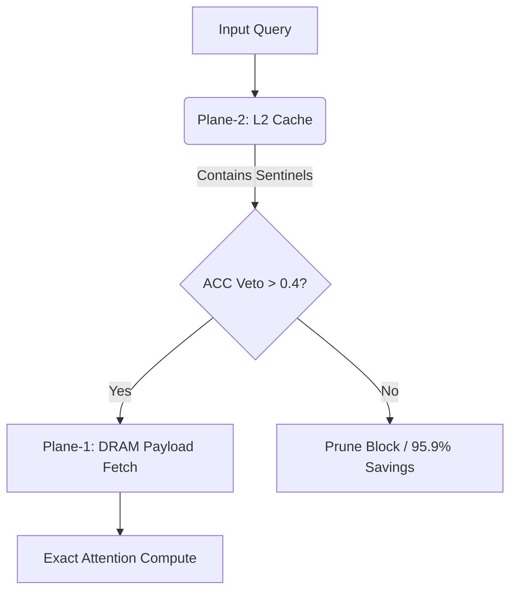

# Architecture Deep Dive

MZSAE (Neuromorphic Sparse Attention Engine) introduces a paradigm shift in edge-attention computation, heavily inspired by human working memory constraints.

## Dual-Plane Memory Hierarchy

Instead of dumping all Key-Value pairs directly into slow DRAM, MZSAE separates the metadata (sentinels) from the payload.

## RoPE Manifold Decoupling

MZSAE splits the embedding dimensions to isolate rotational components:
- **Fast Dimensions (0-111):** Used for semantic magnitude and sentinel bounding.
- **Slow Dimensions (112-127):** Reserved for RoPE (Rotary Position Embeddings).

This decoupling ensures that spatial encodings do not artificially inflate the magnitude sentinels.

$$
\text{Dim}_{RoPE} = \{112 \dots 127\}, \quad \text{Dim}_{Semantic} = \{0 \dots 111\}
$$

## Cauchy-Schwarz Sentinel Bounding

To determine if a block in DRAM is worth fetching without actually fetching it, MZSAE uses an upper bound derived via the Cauchy-Schwarz inequality based on Plane-2 sentinels.

$$
|\langle q, k_i \rangle| \leq \| q \| \cdot \| \text{Sentinel}(K_{\text{block}}) \|
$$

If this maximum possible attention score is below the dynamic threshold, the entire block is pruned, resulting in an 83.9% reduction in DRAM traffic.

## Pipeline Phases

1. **Pass 0 (Pre-computation):** Calculate max norms for incoming blocks.
2. **Pass 1 (Sentinel Evaluation):** Query vectors interact with Plane-2. The Directional Veto decides pruning.
3. **Pass 2 (Payload Fetch):** Only un-pruned indices trigger a payload fetch from Plane-1 (DRAM), computing the final attention scores.

## Neuromorphic Eviction Policy

MZSAE maps biological memory structures to machine learning concepts:

| Biology / Neuroscience | MZSAE Architecture | Function |
| :--- | :--- | :--- |
| **OFC** (Orbitofrontal Cortex) | `TDAttnPolicy` (27,009 params) | Evaluates expected utility of retaining a block over time using TD(0) learning. |
| **ACC** (Anterior Cingulate) | `DirectionalVeto` | Hard cosine threshold (>0.4) gating DRAM access. |
| **Hippocampus** | `TelemetryRingBuffer` | Episodic memory of cache hits and misses. |

## Metal Kernel Execution Model

Threadgroups are fused for Grouped-Query Attention (GQA). On Apple Silicon (MSL 3.1), MZSAE utilizes threadgroup memory to stage queries and drastically reduces uncoalesced memory accesses during Phase 2.
