# MZSAE Branding Guidelines

This document establishes the official brand identity, visual guidelines, and communication style for the MZSAE (Neuromorphic Sparse Attention Engine) project.

## 1. Color Palette

Our color palette is engineered for modern developer tools: high contrast, dark-mode first, and scientifically inspired.

| Color Name      | Hex Code  | RGB               | HSL             | Usage                             |
|-----------------|-----------|-------------------|-----------------|-----------------------------------|
| **Deep Space**  | `#0D1117` | `rgb(13, 17, 23)` | `hsl(216, 28%, 7%)` | Primary background. GitHub dark sync. |
| **Electric Cyan**| `#58A6FF`| `rgb(88, 166, 255)`| `hsl(212, 100%, 67%)`| Primary accent, primary links. |
| **Neural Purple**| `#A371F7`| `rgb(163, 113, 247)`| `hsl(262, 89%, 71%)`| Secondary accent, metrics, features. |
| **Success Green**| `#3FB950`| `rgb(63, 185, 80)` | `hsl(128, 49%, 49%)`| Success states, benchmarks passed. |
| **Warning Amber**| `#D29922`| `rgb(210, 153, 34)`| `hsl(41, 72%, 48%)` | Warnings, WIP features. |
| **Slate Gray**   | `#8B949E` | `rgb(139, 148, 158)`| `hsl(212, 7%, 58%)` | Secondary text, borders. |

## 2. Typography

- **Primary Typeface:** [Inter](https://fonts.google.com/specimen/Inter). Used for all prose, headings, and standard documentation text. It provides exceptional legibility on screens.
- **Monospace/Code:** [JetBrains Mono](https://fonts.google.com/specimen/JetBrains+Mono). Used for code blocks, key metrics (`6.50x`, `83.9%`), terminal output, and equations. Fallbacks: `ui-monospace, SFMono-Regular, Menlo, Monaco, Consolas, monospace`.

## 3. Logo & Visual Guidelines

### Clear Space & Sizing
- Always leave a minimum clear space around the logo equal to the height of the "M" in MZSAE.
- Minimum legible size for web is `24px` height.

### Logo Usage (Do's and Don'ts)
- **DO** use the solid white logo on dark backgrounds (Deep Space Blue).
- **DO** use Electric Cyan for the logo text when highlighting the brand on neutral backgrounds.
- **DON'T** stretch or skew the logo proportions.
- **DON'T** apply drop shadows to the logo text directly; keep it flat and clean.

### ASCII Art Logo
For CLI tools, terminal outputs, and text-only README headers, use the following ASCII block:

```text
  __  __ _____  _____            ______ 
 |  \/  |___  |/ ____|    /\    |  ____|
 | \  / |  / /| (___     /  \   | |__   
 | |\/| | / /  \___ \   / /\ \  |  __|  
 | |  | |/ /__ ____) | / ____ \ | |____ 
 |_|  |_/_____|_____/ /_/    \_\|______|
 
 >> Neuromorphic Sparse Attention Engine v1.2.0
```

## 4. Voice and Tone

The voice of MZSAE documentation and community interaction should be:
- **Technical & Precise:** Back up claims with exact metrics (e.g., "6.50x faster" not "blazing fast").
- **Red-Team Honest:** Acknowledge trade-offs. If there's an overhead at low context lengths, state it clearly.
- **Academic yet Accessible:** Explain biological/neuromorphic concepts (TD(0) RL, Cauchy-Schwarz) with mathematical rigor, but provide practical, engineering-focused summaries.
- **No Hype:** Avoid marketing fluff. Let the Apple Silicon Metal numbers (100% NIAH at 16k) speak for themselves.

## 5. Badges

Use standard [Shields.io](https://shields.io/) badges with the `flat` style. Use the exact hex colors from our palette.

**Markdown Example:**
```markdown


```

## 6. Mermaid Diagrams Style Guide

When rendering Mermaid diagrams in Markdown, align them with the GitHub Dark dimension constraints and MZSAE palette.

**Directives:**
- Nodes: Default `#0D1117`, border `#58A6FF`.
- Highlight/Active Nodes: Fill `#1F2937`, border `#A371F7`.
- Edges: `#8B949E`, stroke-width `2px`.

**Example:**

```mermaid
%%{init: {'theme': 'base', 'themeVariables': { 'primaryColor': '#0D1117', 'primaryBorderColor': '#58A6FF', 'primaryTextColor': '#FFFFFF', 'lineColor': '#8B949E'}}}%%
flowchart LR
    A[Input Query] --> B(RoPE Manifold Decoupling)
    B --> C{Cauchy-Schwarz Sentinel}
    C -- High Magnitude --> D[Compute Full Attention]
    C -- Low Magnitude --> E[TD 0 RL Eviction]
    D --> F[Output]
    E --> F
    
    classDef highlight fill:#1F2937,stroke:#A371F7,stroke-width:2px;
    class B,C highlight;
```

