# Benchmarks

This page outlines the performance characteristics of the MZSAE attention engine across latency, memory usage, and task accuracy.

## Benchmark Suite Overview

| Script | Purpose |
| ------ | ------- |
| `bench_niah.py` | Validates long-context Needle In A Haystack retrieval under extreme memory constraints. |
| `bench_flash_attn_niah.py` | Compares MZSAE's eviction-aware retrieval vs a FlashAttention-style baseline. |
| `bench_real_weights.py` | End-to-end performance test with Qwen2.5-0.5B loaded weights. |
| `bench_selective_fetch.py` | Micro-benchmark validating the 83.9% DRAM load reduction and memory cache lines. |

## Hardware Setup

**Machine:** Apple M4, 16GB Unified Memory  
**OS:** macOS / Metal Shading Language (MSL) 3.1  
**Backend:** Apple Silicon Metal (with CPU reference available)  
**Configuration:** GPULock enabled for stable profiling.

## Master Results

| Context Size | MLX SDPA (ms) | MZSAE (ms) | Speedup | KV Cache (MB) | Accuracy (NIAH) |
| :--- | :--- | :--- | :--- | :--- | :--- |
| 4k | 12.4 | 4.1 | **3.02x** | 4.0 → 1.2 | 100% |
| 16k | 45.1 | 10.8 | **4.17x** | 16.0 → 4.8 | 100% |
| 64k | 185.3 | 32.7 | **5.66x** | 64.0 → 19.5 | N/A |
| 128k | 390.2 | 60.0 | **6.50x** | 128.0 → 39.0 | N/A |

### MZSAE vs Baseline Latency (ms)

```mermaid
xychart-beta
    title "Latency Comparison (ms) - Lower is Better"
    x-axis ["64k", "128k"]
    y-axis "Latency (ms)" 0 --> 400
    bar [185, 390]
    bar [32, 60]
```


*(Blue = MLX SDPA, Green = MZSAE)*

!!! tip "Reproducibility"
    Run the end-to-end benchmarks locally:
    ```bash
    python benchmarks/bench_real_weights.py --model qwen2.5-0.5b --seq-lens 65536 131072
    ```

!!! warning "Limitations & Caveats"
    Please review [LIMITATIONS.md](LIMITATIONS.md) regarding cosine fidelity and non-semantic magnitude beacon effects in NIAH tests.
