# Benchmarks

This page outlines the performance characteristics of the MZSAE attention engine across latency, memory usage, and task accuracy.

## Benchmark Suite Overview

| Script | Purpose |
| ------ | ------- |
| `bench_niah.py` | Validates long-context Needle In A Haystack retrieval under strict physical memory constraints (up to 16k). |
| `bench_flash_attn_niah.py` | Compares MZSAE's eviction-aware retrieval vs a FlashAttention-style baseline. |
| `bench_real_weights.py` | Real model Layer-0 attention projection benchmark with 24-layer E2E throughput estimation. |
| `bench_selective_fetch.py` | Micro-benchmark validating the 83.9% kernel-observed DRAM block reduction and cache lines. |

## Hardware Setup

**Machine:** Apple M4, 16GB Unified Memory  
**OS:** macOS / Metal Shading Language (MSL) 3.1  
**Backend:** Apple Silicon Metal (with CPU reference available)  
**Configuration:** GPULock enabled for stable profiling.

## Master Results (Per-Layer Attention Latency)

*Timings measure per-layer attention decode latency via hardware GPU timestamps. E2E full-model inference throughput across 24 layers scales proportionally (~50–65 tok/s).*

| Context Size | MLX SDPA (ms) | MZSAE (ms) | Speedup | KV Cache (MB) | Accuracy (NIAH, 2k Budget) |
| :--- | :--- | :--- | :--- | :--- | :--- |
| 4k | 1.84 | 1.25 | **1.47x** | 4.0 → 1.2 | 100% (synthetic beacon) |
| 16k | 6.12 | 3.10 | **1.97x** | 16.0 → 4.8 | 100% (synthetic beacon) |
| 64k | 5.27 | 0.93 | **5.66x** | 64.0 → 19.5 | N/A (tested to 16k) |
| 128k | 11.14 | 1.71 | **6.50x** | 128.0 → 39.0 | N/A (tested to 16k) |

### MZSAE vs Baseline Latency (ms)

```mermaid
xychart-beta
    title "Per-Layer Decode Latency (ms) - Lower is Better"
    x-axis ["64k", "128k"]
    y-axis "Latency (ms)" 0 --> 14
    bar [5.27, 11.14]
    bar [0.93, 1.71]
```


*(Blue = MLX SDPA, Green = MZSAE)*

!!! tip "Reproducibility"
    Run the real weights benchmark locally:
    ```bash
    python benchmarks/bench_real_weights.py
    ```

!!! warning "Limitations & Caveats"
    Please review [LIMITATIONS.md](LIMITATIONS.md) regarding cosine fidelity and non-semantic magnitude beacon effects in NIAH tests.
