---
hide:
  - navigation
---

# MZSAE: Neuromorphic Sparse Attention Engine

<p align="center">
  <b>Breaking the Apple Silicon memory wall with biologically-inspired selective fetch</b>
</p>

<p align="center">
  <a href="https://github.com/mohamedhossammohamed/MZSAE" class="md-button md-button--primary">:fontawesome-brands-github: View on GitHub</a>
  <a href="quickstart.md" class="md-button">:material-rocket-launch: Quickstart</a>
  <a href="https://x.com/MohamedHz72007" class="md-button">:fontawesome-brands-x-twitter: Follow Updates</a>
</p>

---

## Performance at a Glance

<div class="grid cards" markdown>

-   :material-speedometer: **6.50× Faster**
    
    ---
    
    Outperforms MLX SDPA by **6.50×** at 128k context ($1.71\text{ ms}$ vs $11.14\text{ ms}$) and **5.66×** at 64k on Apple M4 Metal GPU.

-   :material-memory: **83.9% DRAM Reduction**
    
    ---
    
    Prunes **95.9% of blocks** via L2-resident Cauchy-Schwarz sentinels before streaming payloads across physical DRAM buses.

-   :material-compress: **3.28× KV Compression**
    
    ---
    
    Compresses 128k context KV cache from **128.0 MB down to 39.05 MB** with FIX SET 1 hybrid 4-bit representation.

-   :material-bullseye-arrow: **100% NIAH Accuracy**
    
    ---
    
    Maintains **100.0% retrieval accuracy at 16k context** under a strict 2,048-token memory ceiling where dense FIFO attention collapses to 0.0%.

-   :material-check-decagram: **0.9968 Cosine Fidelity**
    
    ---
    
    Near-lossless attention reconstruction ($>0.996$ cosine similarity) with **40/40 (100%) exact token match** over 16k long context.

-   :material-brain: **Bio-Inspired Eviction**
    
    ---
    
    Neuromorphic **TD(0) reinforcement learning policy** (27,009-param MLP) coupled with Anterior Cingulate (ACC) directional veto.

</div>

---

## Architectural Core

<div class="grid cards" markdown>

-   __Dual-Plane Memory Hierarchy__
    
    Separates compressed payloads in DRAM (Plane 1) from compact 64-byte descriptors in L2 cache (Plane 2).

-   __RoPE Manifold Decoupling__
    
    Splits frequency spectrum into slow quasi-static dimensions ($112..127$) and fast rotating dimensions ($0..111$) for stable bounds.

-   __GQA 6:1 Fused Threadgroups__
    
    Loads and dequantizes each K/V element once into GPU registers, amortizing DRAM transfers across 6 query heads simultaneously.

</div>

---

## Installation

=== "pip (from source)"

    ```bash
    git clone https://github.com/mohamedhossammohamed/MZSAE.git
    cd MZSAE
    make
    pip install -e .
    ```

=== "pip (pre-built wheel)"

    ```bash
    pip install dist/mzsae-1.2.0-py3-none-any.whl
    ```

=== "Development"

    ```bash
    git clone https://github.com/mohamedhossammohamed/MZSAE.git
    cd MZSAE
    make
    pip install -e ".[dev]"
    pytest -v tests/
    ```

---

## 3-Line Quickstart

=== "PyTorch Drop-in Module"

    ```python
    import torch
    from mzsae import MZSAEAttention

    # Drop-in multi-head / grouped-query attention
    attn = MZSAEAttention(embed_dim=2048, num_heads=16, num_kv_heads=4, hardware_profile="auto")
    out = attn(torch.randn(1, 16, 16, 128), torch.randn(1, 16, 4, 128), torch.randn(1, 16, 4, 128), causal=True)
    print("Output shape:", out.shape)  # [1, 16, 16, 128]
    ```

=== "Apple MLX Zero-Copy"

    ```python
    import numpy as np, mlx.core as mx
    from mzsae import MZSAEEngine, load_config

    engine = MZSAEEngine(config=load_config("auto"))
    k_mlx = mx.random.normal((128, 2, 128)).astype(mx.float16)
    v_mlx = mx.random.normal((128, 2, 128)).astype(mx.float16)
    engine.cache.ingest_prefill(np.array(k_mlx), np.array(v_mlx))

    q_mlx = mx.random.normal((12, 128)).astype(mx.float32)
    out_np, telemetry = engine.selective_decode(np.array(q_mlx), return_telemetry=True)
    print(f"Pruned blocks: {telemetry['pruning_ratio']*100:.1f}%")
    ```

=== "Low-Level MZSAEEngine"

    ```python
    import mzsae

    # Load hardware profile (apple_m4, apple_m1, apple_m4_max, or auto)
    config = mzsae.load_config("apple_m4")
    engine = mzsae.MZSAEEngine(config=config)
    print(f"Initialized engine for: {config.hardware.chip_name} ({config.hardware.memory_bandwidth_gbps} GB/s)")
    ```

---

## Benchmark Comparison

```mermaid
xychart-beta
    title "Decode Latency (ms) — Apple M4 (Lower is Better)"
    x-axis ["64k Context", "128k Context"]
    y-axis "Latency (ms)" 0 --> 14
    bar [5.27, 11.14]
    bar [0.93, 1.71]
```



*(First bar: MLX SDPA, Second bar: MZSAE Selective Decode)*

| Context Length | MLX SDPA | MZSAE Decode | Speedup | DRAM Cut | NIAH (Budgeted) |
| :--- | :--- | :--- | :--- | :--- | :--- |
| **4,096** | 1.84 ms | 1.25 ms | **1.47×** | 83.9% | **100.0%** (vs 60%) |
| **8,192** | 3.25 ms | 1.88 ms | **1.73×** | 83.9% | **100.0%** (vs 20%) |
| **16,384** | 6.12 ms | 3.10 ms | **1.97×** | 83.9% | **100.0%** (vs 0% collapse) |
| **64,000** | 5.27 ms | 0.93 ms | **5.66×** | 95.9% | **100.0%** |
| **128,000** | 11.14 ms | 1.71 ms | **6.50×** | 95.9% | **100.0%** |

> [!NOTE]
> Detailed red-team disclosures and edge cases are thoroughly documented in [LIMITATIONS.md](LIMITATIONS.md).
